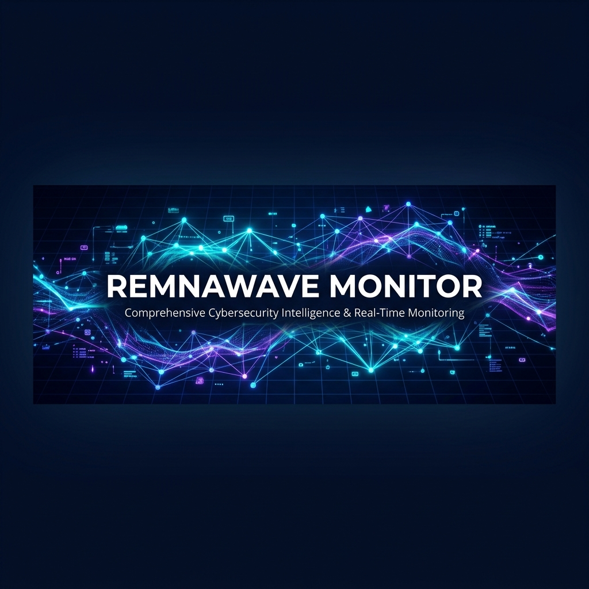

<p align="center">
  
</p>

<h1 align="center">Remnawave Monitor</h1>

<p align="center">
  <strong>Self-hosted панель мониторинга для VPN-панели <a href="https://github.com/remnawave/backend">Remnawave</a></strong>
</p>

<p align="center">
  <a href="#-возможности">Возможности</a> •
  <a href="#-быстрый-старт">Быстрый старт</a> •
  <a href="#-деплой-на-vps">Деплой</a> •
  <a href="#-конфигурация">Конфигурация</a> •
  <a href="#-движок-детекции">Детекция</a> •
  <a href="#-лицензия">Лицензия</a>
</p>

<p align="center">
  
  
  
  
</p>

---

## 📋 Обзор

**Remnawave Monitor** — лёгкая self-hosted веб-панель, которая подключается к вашей [Remnawave](https://github.com/remnawave/backend) VPN-панели и предоставляет:

- **Мониторинг подключений в реальном времени** — кто онлайн, откуда, с каких устройств
- **Детекция злоупотреблений** — автоматическое обнаружение раздачи подписки через анализ HWID
- **Управление инцидентами** — отслеживание, предупреждение и блокировка нарушителей
- **Карта подключений** — визуализация активных сессий на карте мира

Без внешних фреймворков. Чистый Node.js + vanilla JavaScript. Единственная зависимость: `better-sqlite3`.

---

## ✨ Возможности

### 🖥 Дашборд
- Общая статистика: пользователи, активные сессии, HWID-устройства, подозрительные
- Разбивка по странам с live-статистикой
- Интерактивная карта подключений на [Leaflet](https://leafletjs.com/)
- Переключаемые временные окна: Сейчас / 5 мин / 15 мин / 30 мин

### 👥 Активные сессии
- Полный список подключённых пользователей с IP и геолокацией
- Фильтры: много IP, много HWID, по стране
- Сортировка и поиск

### 🔍 Движок детекции
- **HWID-first подход** — аппаратный ID является единственным детерминистическим сигналом
- Многоуровневая оценка риска: 3 категории сигналов (Детерминистические / Сильные / Косвенные)
- Автоматическое создание инцидентов при обнаружении аномалий
- Нулевые ложные срабатывания для мобильных пользователей (учёт CGNAT)

### 🚨 Управление инцидентами
- Статус-машина: `Новый → В работе → Предупреждён → Закрыт / Забанен`
- Заметки оператора и журнал действий
- Автоматическое переоткрытие при повторной детекции
- Отправка предупреждений через Telegram

### 🔗 Граф связей
- Анализ кластеров: IP / ASN / HWID
- Обнаружение мультиаккаунтов через общие устройства
- Скользящее окно 30 минут

### ⚙️ Движок правил
- Настраиваемые правила детекции с порогами
- Автоматические Telegram-уведомления при срабатывании
- Кулдауны и включение/отключение для каждого правила

### 🤖 ИИ-анализ
- Вкладка настроек ИИ с поддержкой OpenAI, OpenRouter, Anthropic, Gemini и OpenAI-compatible endpoint
- Объяснимый анализ подозрительных пользователей поверх существующих сигналов детекции
- В запросы отправляются агрегированные признаки, без сырых HWID и IP

### 🎨 Интерфейс
- Тёмная тема с эффектом glassmorphism
- Поддержка светлой темы
- Адаптивная вёрстка (мобильные устройства)
- Автообновление данных с обратным отсчётом

---

## 🚀 Быстрый старт

### Требования

- **Node.js** ≥ 18.0.0
- Работающая панель **Remnawave** с доступом к API
- *(Опционально)* Инструменты сборки для компиляции `better-sqlite3`: `build-essential`, `python3`

### Автоматическая установка (рекомендуется)

Интерактивный установщик проведёт вас через весь процесс:

```bash
git clone https://github.com/Nurmaga095/remnawave-monitor.git
cd remnawave-monitor
sudo chmod +x setup.sh
sudo ./setup.sh
```

Установщик выполнит:
- ✅ Проверку и установку Node.js при необходимости
- ✅ Установку инструментов сборки для `better-sqlite3`
- ✅ Запрос всех необходимых настроек (логин, пароль, URL панели, API-токен)
- ✅ Генерацию безопасного секрета сессии
- ✅ Создание `.env` с правильными правами доступа
- ✅ Установку npm-зависимостей
- ✅ Создание системного пользователя
- ✅ Настройку systemd-сервиса (автозапуск при загрузке)
- ✅ Опциональную настройку Caddy reverse proxy с HTTPS

### Ручная установка

```bash
git clone https://github.com/Nurmaga095/remnawave-monitor.git
cd remnawave-monitor
cp .env.example .env
npm install --omit=dev
```

### Настройка

Отредактируйте `.env`:

```env
# Учётные данные для входа в панель
APP_USERNAME=admin
APP_PASSWORD=ваш-надёжный-пароль
SESSION_SECRET=замените-на-минимум-32-случайных-символа

# Подключение к Remnawave
REMNAWAVE_BASE_URL=https://your-panel.example.com
REMNAWAVE_API_TOKEN=ваш-api-токен-remnawave

# Опционально: Telegram-предупреждения
TELEGRAM_BOT_TOKEN=токен-вашего-бота

# Опционально: ИИ-анализ
AI_ENABLED=false
AI_PROVIDER=openai
AI_API_KEY=ключ-провайдера
AI_MODEL=gpt-4o-mini
AI_BASE_URL=https://api.openai.com/v1
```

### Запуск

```bash
npm start
```

Откройте `http://127.0.0.1:8787` и войдите с вашими учётными данными.

---

## 🌐 Деплой на VPS

### Ubuntu / Debian

#### 1. Установка зависимостей

```bash
# Node.js 20+
curl -fsSL https://deb.nodesource.com/setup_20.x | sudo -E bash -
sudo apt install -y nodejs

# Инструменты сборки (для better-sqlite3)
sudo apt install -y build-essential python3 make g++

# Caddy (reverse proxy)
sudo apt install -y caddy
```

#### 2. Деплой приложения

```bash
sudo git clone https://github.com/Nurmaga095/remnawave-monitor.git /opt/remnawave-monitor
cd /opt/remnawave-monitor
sudo cp .env.example .env
sudo nano .env  # заполните ваши значения
sudo npm install --omit=dev
```

#### 3. Создание системного пользователя

```bash
sudo useradd --system --home /opt/remnawave-monitor --shell /usr/sbin/nologin remnawave
sudo chown -R remnawave:remnawave /opt/remnawave-monitor
```

#### 4. Установка systemd-сервиса

```bash
sudo cp /opt/remnawave-monitor/remnawave-monitor.service.example \
        /etc/systemd/system/remnawave-monitor.service
sudo systemctl daemon-reload
sudo systemctl enable --now remnawave-monitor
```

#### 5. Настройка Caddy

```bash
sudo cp /opt/remnawave-monitor/Caddyfile.example /etc/caddy/Caddyfile
sudo nano /etc/caddy/Caddyfile  # замените your-domain.example на ваш домен
sudo systemctl reload caddy
```

#### 6. Файрвол

Откройте только порты `22`, `80`, `443`. Порт `8787` **не** должен быть открыт наружу — Caddy проксирует его через HTTPS.

---

## 🔄 Обновление

Когда в репозитории появляется новая версия, обновите установку на сервере:

```bash
cd /opt/remnawave-monitor
sudo systemctl stop remnawave-monitor
sudo git pull origin main
sudo npm install --omit=dev
sudo systemctl start remnawave-monitor
```

> **Примечание:** файлы `.env` и `data/` (база данных) не хранятся в репозитории и не будут затронуты при обновлении. Все ваши настройки и данные сохранятся.

Если вы хотите проверить, что обновление прошло успешно:

```bash
sudo systemctl status remnawave-monitor
sudo journalctl -u remnawave-monitor -n 30 --no-pager
```

---

## ⚙️ Конфигурация

Все настройки задаются через переменные окружения в `.env`:

### Основные

| Переменная | Описание | По умолчанию |
|---|---|---|
| `PORT` | HTTP-порт | `8787` |
| `APP_USERNAME` | Логин для входа | — |
| `APP_PASSWORD` | Пароль для входа | — |
| `SESSION_SECRET` | HMAC-секрет (≥32 символа) | — |
| `REMNAWAVE_BASE_URL` | URL панели Remnawave | — |
| `REMNAWAVE_API_TOKEN` | API-токен Remnawave | — |
| `TELEGRAM_BOT_TOKEN` | Токен Telegram-бота для предупреждений | — |

### ИИ-анализ

Эти параметры можно задать в `.env` или через вкладку **Настройки → Настройка ИИ** в панели.

| Переменная | Описание | По умолчанию |
|---|---|---|
| `AI_ENABLED` | Включить ИИ-анализ | `false` |
| `AI_PROVIDER` | `openai`, `openrouter`, `anthropic`, `google`, `custom` | `openai` |
| `AI_API_KEY` | API-ключ выбранного провайдера | — |
| `AI_MODEL` | Название модели | `gpt-4o-mini` |
| `AI_BASE_URL` | Base URL API | `https://api.openai.com/v1` |
| `AI_TEMPERATURE` | Температура ответа | `0.2` |
| `AI_MAX_TOKENS` | Максимум токенов ответа | `900` |
| `AI_TIMEOUT_SECONDS` | Таймаут запроса | `30` |

### Синхронизация и хранение

| Переменная | Описание | По умолчанию |
|---|---|---|
| `DB_PATH` | Путь к базе данных SQLite | `./data/remnawave-monitor.sqlite` |
| `SYNC_INTERVAL_SECONDS` | Интервал цикла синхронизации | `60` |
| `IP_HISTORY_RETENTION_HOURS` | Хранение IP-снапшотов | `24` |
| `SYNC_LOG_RETENTION_DAYS` | Хранение логов синхронизации | `7` |

### HWID

| Переменная | Описание | По умолчанию |
|---|---|---|
| `HWID_DETAILS_LIMIT` | Макс. пользователей для загрузки HWID-деталей | `150` |
| `HWID_DETAILS_CONCURRENCY` | Параллельные HWID-запросы | `8` |

### Геолокация IP

| Переменная | Описание | По умолчанию |
|---|---|---|
| `IP_GEO_ENABLED` | Включить кэширование геолокации | `true` |
| `IP_GEO_CACHE_TTL_DAYS` | TTL кэша геолокации | `7` |
| `IP_GEO_SYNC_LIMIT` | Макс. новых IP за синхронизацию | `200` |
| `IP_GEO_CONCURRENCY` | Параллельные geo-запросы | `4` |

---

## 🔍 Движок детекции

Движок анализирует поведение пользователей с подходом **device-first**. HWID (аппаратный идентификатор) — единственный детерминистический сигнал для обнаружения злоупотреблений.

### Категории сигналов

| Категория | Описание | Может вызвать действие? |
|---|---|---|
| **ДЕТЕРМИНИСТИЧЕСКИЕ** | Объективные факты (HWID > лимит) | ✅ Авто-эскалация |
| **СИЛЬНЫЕ** | Высокая корреляция (ротация HWID, активность 24/7, избыток IP) | ✅ В комбинации |
| **КОСВЕННЫЕ** | Только контекст (разнообразие стран, трафик) | ❌ Никогда самостоятельно |

### Уровни риска

| Баллы | Уровень | Описание |
|---|---|---|
| 80+ | 🔴 Критический | HWID сверх лимита или комбинация сильных сигналов |
| 60–79 | 🟠 Высокий риск | Детерминистические или сильные сигналы |
| 40–59 | 🟡 Подозрительный | Требуются сильные сигналы |
| 20–39 | 🔵 Внимание | Любой сигнал |
| <20 | ⚪ Чисто | Нет проблем |

### Учёт CGNAT

Движок специально спроектирован для **исключения ложных срабатываний** на мобильных пользователях за CGNAT. IP-сигналы сами по себе никогда не могут вызвать детекцию — они предоставляют только контекст для оператора.

---

## 🏗 Архитектура

```
remnawave-monitor/
├── src/
│   ├── server.js            # HTTP-сервер, роутинг, авторизация, прокси
│   ├── remnawave-sync.js    # Фоновая синхронизация с Remnawave API
│   ├── sync-store.js        # SQLite data layer
│   ├── detect.js            # Движок детекции
│   ├── rules.js             # Движок правил
│   ├── ai-service.js        # Провайдеры и запросы ИИ-анализа
│   └── ip-check.js          # Утилиты анализа IP
├── public/
│   ├── index.html           # SPA-оболочка
│   ├── js/app.js            # Фронтенд-приложение
│   └── css/style.css        # Стили (тёмная/светлая тема)
├── setup.sh                 # Интерактивный установщик
├── .env.example             # Шаблон конфигурации
├── Caddyfile.example        # Конфиг Caddy reverse proxy
└── remnawave-monitor.service.example  # systemd unit
```

### Как это работает

1. **Цикл синхронизации** — сервер периодически забирает данные о пользователях, активных IP и HWID из Remnawave API
2. **Гео-обогащение** — IP-адреса обогащаются данными о стране/ASN/типе сети через [ipwho.is](https://ipwho.is)
3. **Детекция** — после каждого цикла запускается движок детекции для обнаружения аномалий
4. **Инциденты** — обнаруженные аномалии автоматически создают/обновляют инциденты
5. **Дашборд** — SPA-фронтенд читает кэшированные данные через локальный API

### Безопасность

- API-токен хранится только на сервере — браузер его никогда не получает
- Авторизация через логин/пароль с `HttpOnly` cookie сессии
- Сервер слушает `127.0.0.1` по умолчанию — используйте reverse proxy (Caddy/Nginx) для HTTPS
- Эндпоинт `/proxy` перенаправляет запросы только на настроенный инстанс Remnawave

---

## 📦 Технологии

- **Среда выполнения**: Node.js (без фреймворков, чистый модуль `http`)
- **База данных**: SQLite через [better-sqlite3](https://github.com/WiseLibs/better-sqlite3)
- **Фронтенд**: Vanilla JavaScript SPA
- **Карты**: [Leaflet](https://leafletjs.com/)
- **Шрифты**: [Inter](https://rsms.me/inter/), [JetBrains Mono](https://www.jetbrains.com/lp/mono/)
- **Reverse Proxy**: [Caddy](https://caddyserver.com/) (рекомендуется)

---

## 🤝 Участие в разработке

Мы приветствуем вклад в проект! Вы можете отправить Pull Request.

1. Сделайте форк репозитория
2. Создайте ветку для фичи: `git checkout -b feature/amazing-feature`
3. Зафиксируйте изменения: `git commit -m 'Добавить крутую фичу'`
4. Отправьте ветку: `git push origin feature/amazing-feature`
5. Откройте Pull Request

---

## 📄 Лицензия

Проект распространяется под лицензией MIT — подробности в файле [LICENSE](LICENSE).

---

<p align="center">
  Создано с ❤️ для сообщества Remnawave
</p>
